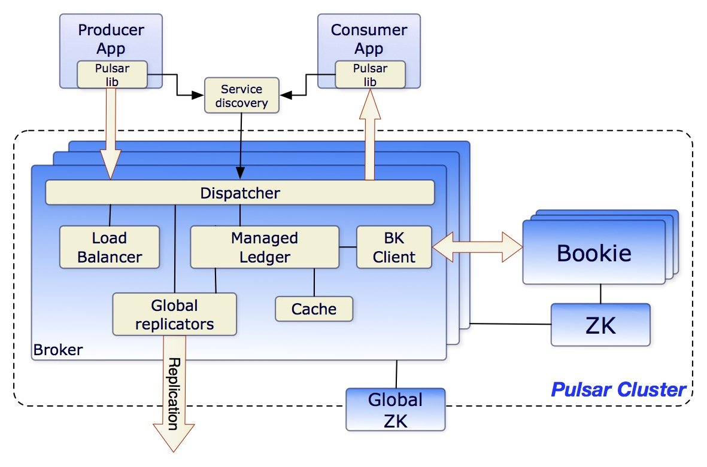
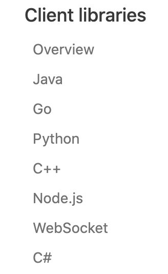

# Pulsar 入门及介绍

(#背景 "背景")背景

我们最近在做新业务的技术选型，其中涉及到了对消息中间件的选择；结合我们的实际情况希望它能满足以下几个要求：
<!-- more -->
* 友好的云原生支持：因为现在的主力语言是 `Go`，同时在运维上能够足够简单。
* 官方支持多种语言的 `SDK`：还有一些 `Python`、`Java` 相关的代码需要维护。
* 最好是有一些方便好用的特性，比如：延时消息、死信队列、多租户等。
<!--more-->

当然还有一些水平扩容、吞吐量、低延迟这些特性就不用多说了，几乎所有成熟的消息中间件都能满足这些要求。

基于以上的筛选条件，`Pulsar` 进入了我们的视野。

作为 `Apache` 下的顶级项目，以上特性都能很好的支持。

下面我们来它有什么过人之处。

# 架构

从官方的架构图中可以看出 `Pulsar` 主要有以下组件组成：

1.  `Broker` 无状态组件，可以水平扩展，主要用于生产者、消费者连接；与 Kafka 的 broker 类似，但没有数据存储功能，因此扩展更加轻松。
2.  `BookKeeper` 集群：主要用于数据的持久化存储。
3.  `Zookeeper` 用于存储 `broker` 与 `BookKeeper` 的元数据。

整体一看似乎比 Kafka 所依赖的组件还多，这样确实会提供系统的复杂性；但同样的好处也很明显。

`Pulsar` 的存储于计算是分离的，当需要扩容时会非常简单，直接新增 `broker` 即可，没有其他的心智负担。

当存储成为瓶颈时也只需要扩容 `BookKeeper`，不需要人为的做重平衡，`BookKeeper` 会自动负载。

同样的操作，`Kafka` 就要复杂的多了。

## 特性

### 多租户

多租户也是一个刚需功能，可以在同一个集群中对不同业务、团队的数据进行隔离。

<table><tbody><tr><td class="gutter"><pre>
1
</pre></td><td class="code"><pre>
persistent://core/order/create-order
</pre></td></tr></tbody></table>

以这个 topic 名称为例，在 `core` 这个租户下有一个 `order` 的 `namespace`，最终才是 `create-order` 的 `topic` 名称。

在实际使用中租户一般是按照业务团队进行划分，`namespace` 则是当前团队下的不同业务；这样便可以很清晰的对 topic 进行管理。

通常有对比才会有伤害，在没有多租户的消息中间件中是如何处理这类问题的呢：

1.  干脆不分这么细，所有业务线混着用，当团队较小时可能问题不大；一旦业务增加，管理起来会非常麻烦。
2.  自己在 topic 之前做一层抽象，但其实本质上也是在实现多租户。
3.  各个业务团队各自维护自己的集群，这样当然也能解决问题，但运维复杂度自然也就提高了。

以上就很直观的看出多租户的重要性了。

### Function 函数计算

`Pulsar` 还支持轻量级的函数计算，例如需要对某些消息进行数据清洗、转换，然后再发布到另一个 topic 中。

这类需求就可以编写一个简单的函数，`Pulsar` 提供了 `SDK` 可以方便的对数据进行处理，最后使用官方工具发布到 `broker` 中。

在这之前这类简单的需求可能也需要自己处理流处理引擎。

## 应用

除此之外的上层应用，比如生产者、消费者这类概念与使用大家都差不多。

比如 `Pulsar` 支持四种消费模式：

* `Exclusive`：独占模式，同时只有一个消费者可以启动并消费数据；通过 `SubscriptionName` 标明是同一个消费者），适用范围较小。
* `Failover` 故障转移模式：在独占模式基础之上可以同时启动多个 `consumer`，一旦一个 `consumer` 挂掉之后其余的可以快速顶上，但也只有一个 `consumer` 可以消费；部分场景可用。
* `Shared` 共享模式：可以有 N 个消费者同时运行，消息按照 `round-robin` 轮询投递到每个 `consumer` 中；当某个 `consumer` 宕机没有 `ack` 时，该消息将会被投递给其他消费者。这种消费模式可以提高消费能力，但消息无法做到有序。
* `KeyShared` 共享模式：基于共享模式；相当于对同一个`topic`中的消息进行分组，同一分组内的消息只能被同一个消费者有序消费。

第三种共享消费模式应该是使用最多的，当对消息有顺序要求时可以使用 `KeyShared` 模式。

## SDK

官方支持的 `SDK` 非常丰富；我也在官方的 `SDK` 的基础之上封装了一个内部使用的 `SDK`。

因为我们使用了 [dig](https://pkg.go.dev/go.uber.org/dig) 这样的轻量级依赖注入库，所以使用起来大概是这个样子：

<table><tbody><tr><td class="gutter"><pre>
1

2

3

4

5

6

7

8

9

10

11

12

13

14

15

16

17

18

19

20

21

22

23
</pre></td><td class="code"><pre>
SetUpPulsar(lookupURL)

container := dig.New()

container.Provide(func() ConsumerConfigInstance {

	return NewConsumer(&amp;pulsar.ConsumerOptions{

		Topic:            "persistent://core/order/create-order",

		SubscriptionName: "order-sub",

		Type:             pulsar.Shared,

		Name:             "consumer01",

	}, ConsumerOrder)

})

container.Provide(func() ConsumerConfigInstance {

	return NewConsumer(&amp;pulsar.ConsumerOptions{

		Topic:            "persistent://core/order/update-order",

		SubscriptionName: "order-sub",

		Type:             pulsar.Shared,

		Name:             "consumer02",

	}, ConsumerInvoice)

})

container.Invoke(StartConsumer)
</pre></td></tr></tbody></table>

其中的两个 `container.Provide()` 函数用于注入 `consumer` 对象。

`container.Invoke(StartConsumer)` 会从容器中取出所有的 `consumer` 对象，同时开始消费。

这时以我有限的 `Go` 开发经验也在思考一个问题，在 `Go` 中是否需要依赖注入？

先来看看使用 `Dig` 这类库所带来的好处：

* 对象交由容器管理，很方便的实现单例。
* 当各个对象之前依赖关系复杂时，可以减少许多创建、获取对象的代码，依赖关系更清晰。

同样的坏处也有：

* 跟踪阅读代码时没有那么直观，不能一眼看出某个依赖对象是如何创建的。
* 与 Go 所推崇的简洁之道不符。

对于使用过 `Spring` 的 `Java` 开发者来说肯定直呼真香，毕竟还是熟悉的味道；但对于完全没有接触过类似需求的 `Gopher` 来说貌似也不是刚需。

目前市面上各式各样的 Go 依赖注入库层出不穷，也不乏许多大厂出品，可见还是很有市场的。

我相信有很多 `Gopher` 非常反感将 `Java` 中的一些复杂概念引入到 `Go`，但我觉得依赖注入本身是不受语言限制，各种语言也都有自己的实现，只是 Java 中的 Spring 不仅仅只是一个依赖注入框架，还有许多复杂功能，让许多开发者望而生畏。

如果只是依赖注入这个细分需求，实现起来并不复杂，并不会给带来太多复杂度。如果花时间去看源码，在理解概念的基础上很快就能掌握。

回到 `SDK` 本身来说，`Go` 的 `SDK` 现阶段要比 `Java` 版本的功能少（准确来说只有 `Java` 版的功能最丰富），但核心的都有了，并不影响日常使用。

# 总结

本文介绍了 `Pulsar` 的一些基本概念与优点，同时顺便讨论一下 `Go` 的依赖注入；如果大家和我们一样在做技术选型，不妨考虑一下 `Pulsar`。

后续会继续分享 Pulsar 的相关内容，有相关经验的朋友也可以在评论区留下自己的见解。

我很有眼光！

请我吃🍗

赏

微信打赏

支付宝打赏

[#Go](/tags/Go/) [#消息队列](/tags/消息队列/)

[利用 GitHub Action 自动发布 Docker](/2021/03/26/go/github-actions/ "利用 GitHub Action 自动发布 Docker")