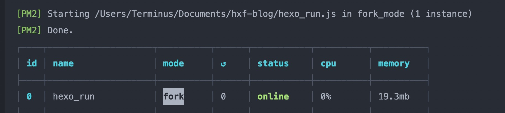

**安装pm2**

```shell
npm  install -g pm2
```
<!-- more -->
在博客根目录下面创建一个**hexo_run.js**

```javascript
//run
const { exec } = require('child_process')
exec('hexo server',(error, stdout, stderr) => {
        if(error){
                console.log('exec error: ${error}')
                return
        }
        console.log('stdout: ${stdout}');
        console.log('stderr: ${stderr}');
})
```

在根目录下

```shell
pm2 start hexo_run.js
```

结果如下图

